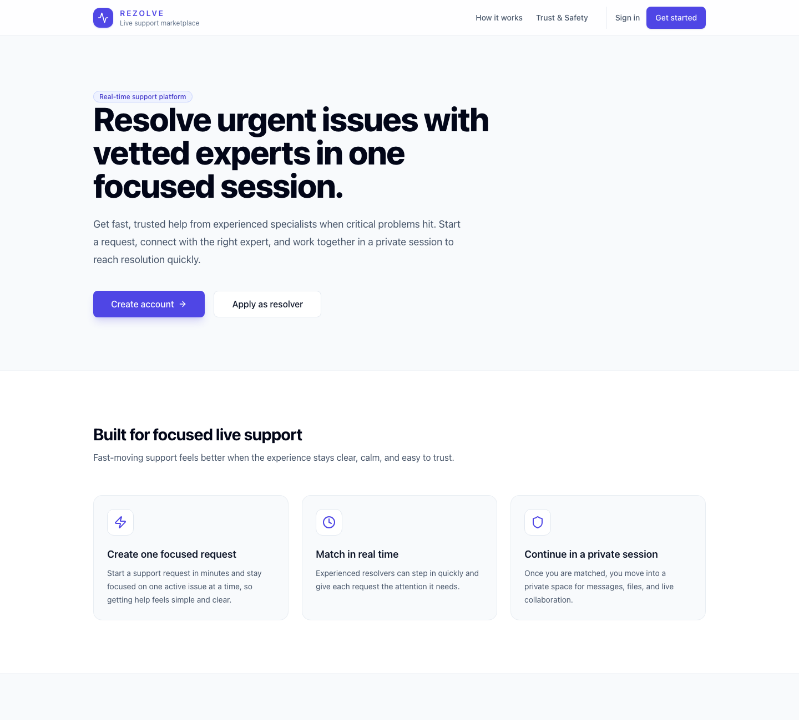

# Rezolve

Rezolve is a live support marketplace for urgent technical and operational problems. A user opens a request, an approved expert (a **resolver**) claims it, and the two work together in a private support session. The product is designed around a clear ticket lifecycle: find help quickly while a request is live, then continue through an offline queue if no resolver is available right away.

The central engineering challenge is the claim itself: when several resolvers choose the same request, exactly one should receive it. This repository is an early implementation of that product. It contains the web experience and an authentication and resolver approval service; the complete live ticket and session flow is still in progress.

## UI preview



*The current public landing page, captured from the running Vite app.*

## What is in this repository

| Area | Current role |
| --- | --- |
| [`RezolveUI/`](RezolveUI/) | React, TypeScript, Vite, and Tailwind UI for the landing page, sign-in, user workspace, resolver onboarding/workspace, and admin workspace. |
| [`Backend/`](Backend/) | FastAPI service for Supabase-backed identity, application profiles, resolver applications, and admin review. It uses PostgreSQL through SQLAlchemy. |

Supabase handles sign-in and account identity. The backend owns application roles and resolver approval. User and resolver ticket dashboards, the live pool, and support sessions currently display sample data in the UI. Ticket database code exists in `Backend`, but its routes are not mounted in the running FastAPI app yet. Live matching, the offline queue, notifications, and private real-time communication remain planned work.

## Run locally

You will need Node.js, Python, and a Supabase project. Copy the example environment files and replace their placeholders with your own project values. Keep local environment files untracked.

### Frontend

```bash
cd RezolveUI
cp .env.example .env.local
npm ci
npm run dev
```

Open <http://localhost:8443>. The frontend needs `VITE_SUPABASE_URL` and `VITE_SUPABASE_ANON_KEY`; `VITE_API_BASE_URL` points to the FastAPI service for profile and resolver workflows.

### Backend

```bash
cd Backend
python3 -m venv .venv
source .venv/bin/activate
pip install -r requirements.txt
cp .env.example .env
uvicorn app.main:app --reload --port 8000
```

Set `DATABASE_URL` and the Supabase values in `Backend/.env` before starting the service. The auth endpoints require `profiles` and `resolver_applications` tables in that database. Their bootstrap migration is not checked into this repository; [`Backend/sql/schema.sql`](Backend/sql/schema.sql) defines separate, earlier ticket tables and does not initialize the auth service. Once configured, the API documentation is at <http://localhost:8000/docs>.
